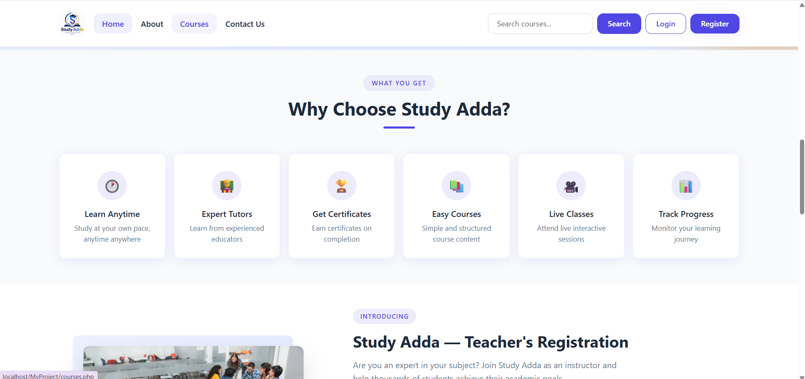
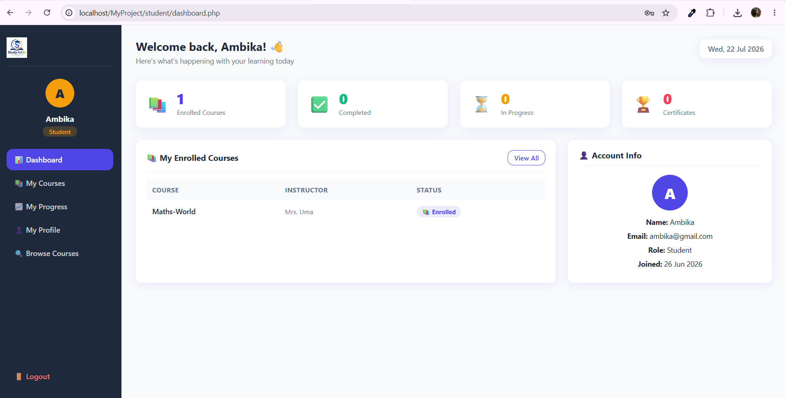
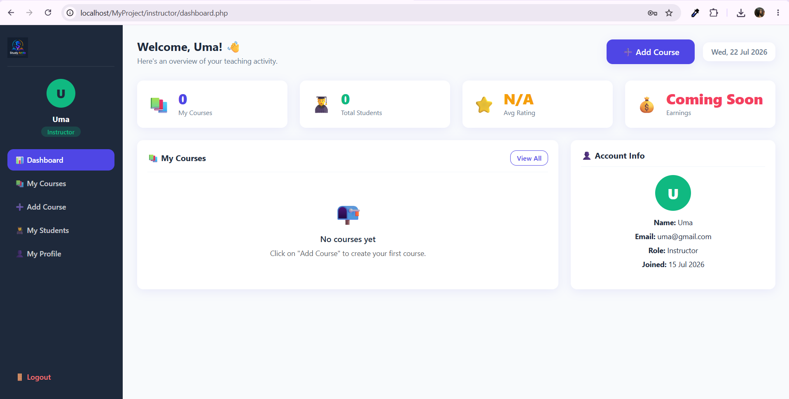
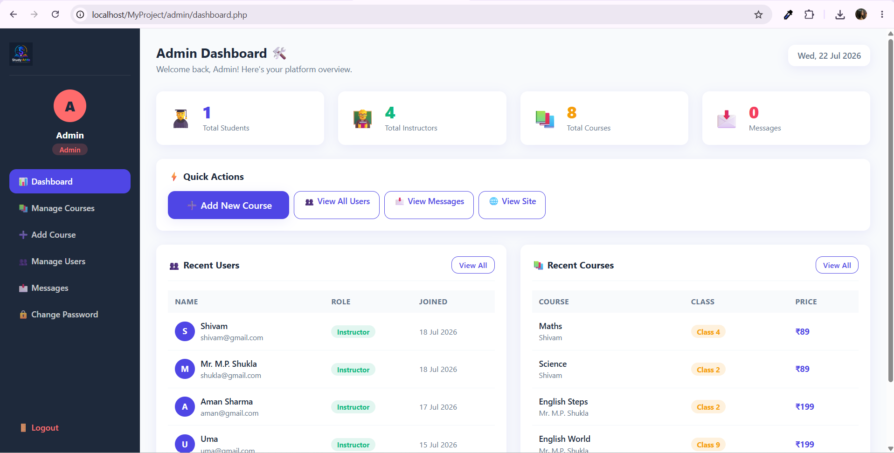
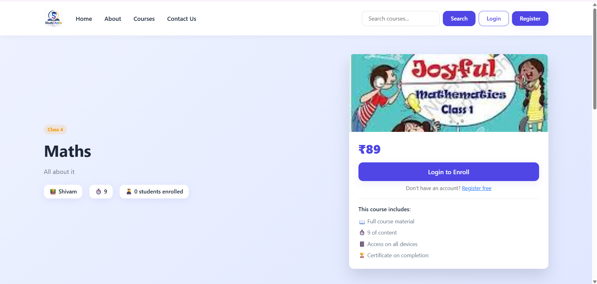
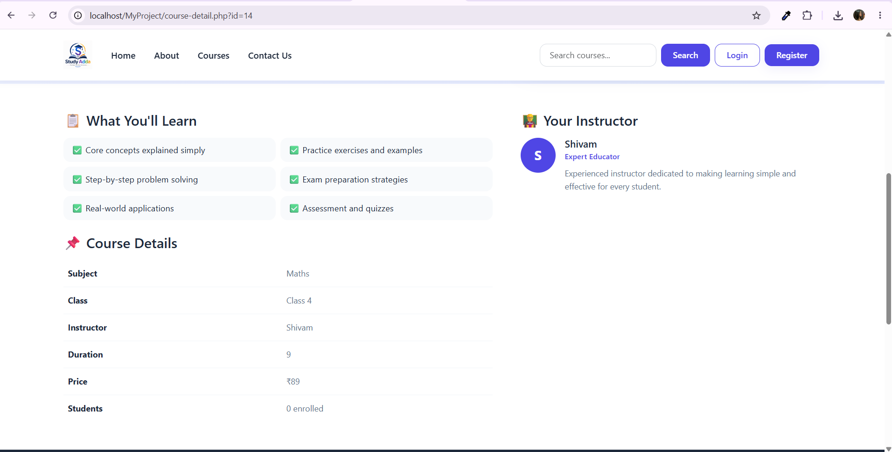

# 📚 Study Adda - Learning Management System

A full-stack Learning Management System (LMS) built using PHP, MySQL, Bootstrap, and JavaScript with role-based access for Students, Instructors, and Admins.

### Key Highlights

- Role-Based Access Control (Student, Instructor, Admin)
- Course & Lesson Management
- Student Enrollment & Progress Tracking
- Secure Authentication & Password Recovery
- Responsive Dashboard for All Roles
- File Upload Support for Course Images
- Built with Core PHP + MySQL

---

## 🔗 Live Demo

> _Add your live deployment link here_

---

## Screenshots

### Homepage




### Student Dashboard



### Instructor Dashboard



### Admin Dashboard



### Course Detail Page




### Lesson Player


---

## Features

### Student

- Browse and enroll in courses
- Track learning progress
- Watch video lessons
- Manage profile and password
- Recover account using security questions

### Instructor

- Create and manage courses
- Add, edit, and delete lessons
- View enrolled students
- Manage course details and images
- Dashboard with course statistics

### Admin

- Manage users and courses
- View contact messages
- Full course CRUD operations
- Platform-wide dashboard statistics
- Password management

---

## Tech Stack

| Layer          | Technology                            |
| -------------- | ------------------------------------- |
| Frontend       | HTML, CSS, Bootstrap 5, JavaScript    |
| Backend        | PHP                                   |
| Database       | MySQL                                 |
| Authentication | Session-Based Authentication          |
| Security       | Prepared Statements, Password Hashing |

---

## Security Features

- Password hashing (`password_hash`)
- Prepared statements (`mysqli_prepare`)
- Role-Based Access Control
- File upload validation
- Session-based authentication
- Security-question-based password recovery

---

## Getting Started (Local Setup)

### Prerequisites

- PHP 8.x
- MySQL 5.7+
- XAMPP / WAMP

### Installation

```bash
# 1. Clone the repository
git clone https://github.com/ambikaas27/study-adda-lms.git

# 2. Move the project into your XAMPP htdocs folder
# Copy the cloned folder into C:\xampp\htdocs\

# 3. Start Apache and MySQL from XAMPP Control Panel

# 4. Create the database
# Open http://localhost/phpmyadmin
# Create a new database named: studyadda_db
# Import the schema file: database/studyadda_db.sql

# 5. Configure database connection
# Open includes/dbconfig.php and set your local credentials:
#   DB_HOST = 127.0.0.1
#   DB_USER = root
#   DB_PASS = ''
#   DB_NAME = studyadda_db

# 6. Visit the project in your browser
http://localhost/study-adda-lms/
```

### Test Accounts

| Role       | Email               | Password |
| ---------- | ------------------- | -------- |
| Admin      | admin@studyadda.com | password |
| Instructor | uma@studyadda.com   | 123456   |
| Student    | ambika@gmail.com    | 123456   |

---

## Project Structure

```text
study-adda-lms/
├── admin/
│   ├── dashboard.php
│   ├── courses.php
│   ├── add-course.php
│   ├── edit-course.php
│   ├── users.php
│   └── messages.php
├── instructor/
│   ├── dashboard.php
│   ├── my-courses.php
│   └── manage-lessons.php
├── student/
│   ├── dashboard.php
│   ├── courses.php
│   ├── progress.php
│   ├── profile.php
│   └── lesson.php
├── includes/
│   ├── header.php
│   ├── footer.php
│   ├── dbconfig.php
│   └── toast.php
├── css/
│   └── style.css
├── images/
│   └── courses/
├── database/
│   └── studyadda_db.sql
├── screenshots/
├── index.php
├── about.php
├── courses.php
├── course-detail.php
├── contact.php
├── search.php
├── login.php
├── register.php
├── logout.php
└── README.md
```

---

## 👤 Author

**Ambika A S**

- Portfolio: [ambikaas27.github.io/my-portfolio](https://ambikaas27.github.io/my-portfolio)
- GitHub: [@ambikaas27](https://github.com/ambikaas27)

---

## 📄 License

This project is open source and available under the [MIT License](LICENSE).
